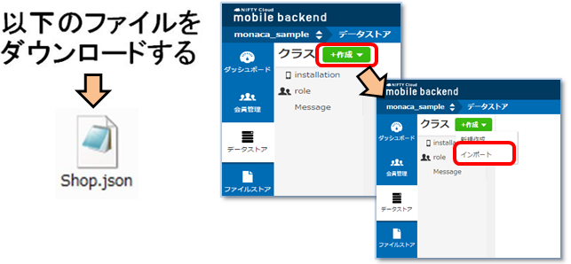

# Monaca x NIFTY Cloud mobile backend 位置情報検索サンプル

===

# Overview

Monacaを用いて作ったアプリから、mobile backendと連携して、位置情報データを検索しGoogle Map地図上に表示するサンプルコードとなります。
* HTML/CSS/JavaScriptでマルチプラットフォーム（iOS/Android/Windowsなど）にアプリを開発できる統合開発環境[Monaca](https://ja.monaca.io/)
* スマホアプリのサーバ側機能（プッシュ通知、会員管理、DBなど）をサーバ開発不要で実装できる[NIFTY Cloud mobile backend](http://mb.cloud.nifty.com/?utm_source=community&utm_medium=referral&utm_campaign=sample_monaca_map_template)


## Demo

* mBaaSサーバー側：事前に、位置情報データを用意します(Storeクラスへインポート)。
* MonacaでgithubのURL(https://github.com/ncmbadmin/monaca_map_template/archive/master.zip)をインポートし、アプリケーションキーとクライントキーを設定してください。
* アプリを起動（プレビュー）し、「地図でお店を見る」ボタンを押すと、取得した現在地データをもとに5km範囲のデータを取得し、地図上に表示します。

* トップ画面


* 位置情報検索を行い、データを表示


## Description

* コードの説明

File: www/js/app.js

 - 初期化設定

```JavaScript
var appKey    = "YOUR_APPKEY";
var clientKey = "YOUR_CLIENTKEY";

///// Called when app launch
$(function() {
  NCMB.initialize(appKey, clientKey);
});
```

上記のコードでアプリケーションキーとクライアントキーを指定し、
NCMB.initialize(appKey, clientKey)　でmBaaSサーバと連携を行います。

* 現在地取得

「地図でお店を見る」ボタンの処理メソッドは、以下のように実装しています。
```JavaScript
navigator.geolocation.getCurrentPosition(onSuccess, onError, null);
```

* 現在地取得が成功した場合のコールバック、onSuccessは以下のように設定しています。

```JavaScript
var onSuccess = function(position){
    var location = { lat: position.coords.latitude, lng: position.coords.longitude};
    //mobile backendに登録しているストアを取得し、地図で表示
    //位置情報を検索するクラスのNCMB.Objectを作成する
    var StoreClass = NCMB.Object.extend(storeClassName);
    //NCMB.Queryを作成
    var query = new NCMB.Query(StoreClass);
    //位置情報をもとに検索する条件を設定
    var geoPoint = new NCMB.GeoPoint(location.lat, location.lng);
    query.withinKilometers("geolocation", geoPoint, 5);
    var mapOptions = {
                    center: location,
                    zoom: 14
                };
    var map = new google.maps.Map(document.getElementById('map_canvas'),mapOptions);
    //現在地を地図に追加
    markToMap("現在地", location, map, null);
    //mobile backend上のデータ検索を実行する
    query.find({
        success: function(stores) {
            // 検索が成功した場合の処理
            for (var i = 0; i < stores.length; i++){
                var store = stores[i];
                var storeLocation = store.get("geolocation");
                var myLatlng = new google.maps.LatLng(storeLocation.latitude, storeLocation.longitude);
                //CREATE DETAIL
                var detail = "";
                var storeName = store.get("name");
                detail += "<h2>"+ storeName +"</h2>";
                var storeCapacity = store.get("capacity");
                var storeLocation = store.get("geolocation");
                var storeLatLng = new google.maps.LatLng(storeLocation.latitude,storeLocation.longitude);
                var locationLatLng = new google.maps.LatLng(location.lat,location.lng);
                var distance = Math.round(google.maps.geometry.spherical.computeDistanceBetween (locationLatLng, storeLatLng));  
                detail += "<p>距離: "+ distance + "(m)</p>";
                detail += "<p>席数: " + storeCapacity + "</p>" ;
                markToMap(detail, myLatlng, map, 'images/marker_mbaas.png');
            }
        },
        error: function(error) {
            // 検索に失敗した場合の処理
            alert(error.message);
        }
    });
};
```

"Store"というクラスのデーターを検索するオブジェクトqueryを作ります。

検索条件は query.withinKilometers("geolocation", geoPoint, 5); と設定し、geolocationというクラスの中にある、現在地（geoPoint）から5kmの範囲のキーの値を検索します。
find()メソッドを利用し、非同期にて検索を行います。

find()した後のコールバックを定義します。成功した場合にはstoresにデータが入っているはずなので、markToMap()メソッドを利用して、地図にマーカーを付けます。

## Requirement

* Monaca環境
* NIFTY Cloud mobile backend Javascript SDK version 1.2.6　ダウンロード：[Javascript SDK](http://mb.cloud.nifty.com/doc/current/introduction/sdkdownload_javascript.html?utm_source=community&utm_medium=referral&utm_campaign=sample_monaca_map_template)

## Installation

* Monacaで新規アプリ作成し、プロジェクトをインポートする。
  - Monacaの利用登録
    [Monaca](https://ja.monaca.io/)

  - Monacaで新規プロジェクトを作成し、プロジェクトのインポートを選択します。

  - 「URLからインポートする」を選択し、URLに https://github.com/ncmbadmin/sample_monaca_login_template/archive/master.zip を指定します。


* mobile backendでアプリ作成する
  - mobile backend 利用登録
    [NIFTY Cloud mobile backend](http://mb.cloud.nifty.com/?utm_source=community&utm_medium=referral&utm_campaign=sample_monaca_map_template)

  - mobile backendでアプリ作成する


* mobile backend側でデータをインポートする
 - 以下のURLからStore.jsonファイルをダウンロードする。
https://gist.github.com/ncmbadmin/c2bef258d2a63c40b0b1/archive/e9a844ed6b43d64cfc166b1788975890ff50280a.zip

mBaaSデータストアにて、作成 ＞ インポートを選択し、ダウンロードしたjsonファイルを指定してインポートする。



インポートが成功した状態


* Monacaで作成したアプリをmobile backendサーバーと連携させる
  - Monacaでアプリキー、クライアントキーを設定し、初期化を行う

キーをコピーし、追記します。


* Google map API キーの設定
 - ファイル：index.html
 - 方法は以下のように設定
 Google console: https://code.google.com/apis/console


* 動作確認
  - Monacaで動作確認する 


## Usage

サンプルコードをカスタマイズすることで、様々な機能を実装できます！
データ保存・データ検索・会員管理・プッシュ通知などの機能を実装したい場合には、
以下のドキュメントもご参考ください。

* [ドキュメント](http://mb.cloud.nifty.com/doc/current/?utm_source=community&utm_medium=referral&utm_campaign=sample_monaca_map_template)
* [ドキュメント・データストア](http://mb.cloud.nifty.com/doc/current/sdkguide/javascript/datastore.html?utm_source=community&utm_medium=referral&utm_campaign=sample_monaca_map_template)
* [ドキュメント・会員管理](http://mb.cloud.nifty.com/doc/current/sdkguide/javascript/user.html?utm_source=community&utm_medium=referral&utm_campaign=sample_monaca_map_template)
* [ドキュメント・プッシュ通知](http://mb.cloud.nifty.com/doc/current/sdkguide/javascript/push.html?utm_source=community&utm_medium=referral&utm_campaign=sample_monaca_map_template)

## Contributing

1. Fork it!
2. Create your feature branch: `git checkout -b my-new-feature`
3. Commit your changes: `git commit -am 'Add some feature'`
4. Push to the branch: `git push origin my-new-feature`
5. Submit a pull request :D

## License

* MITライセンス
* NIFTY Cloud mobile backendのJavascript SDKのライセンス
