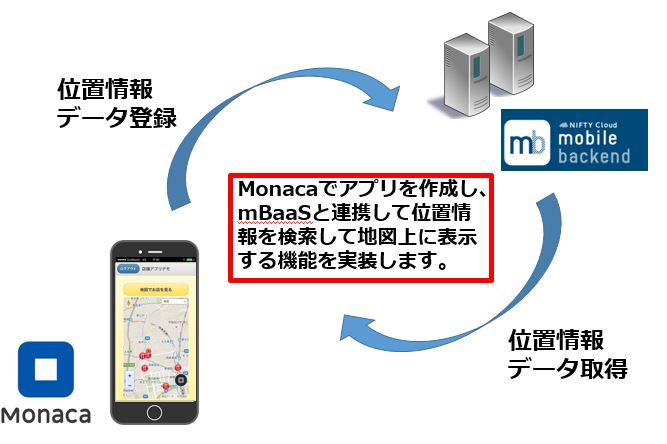
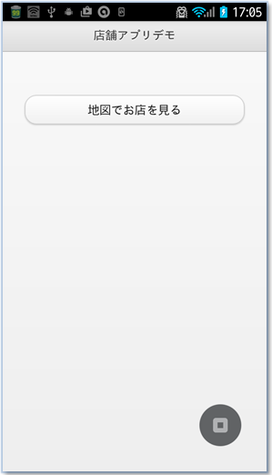
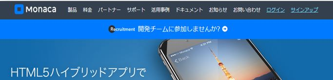
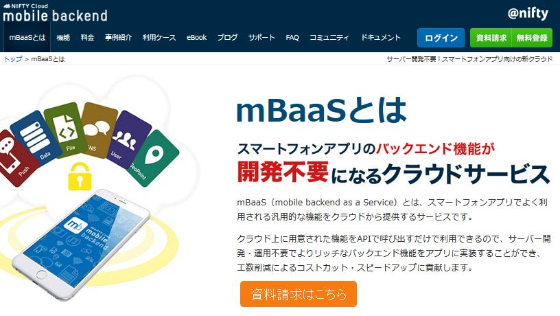
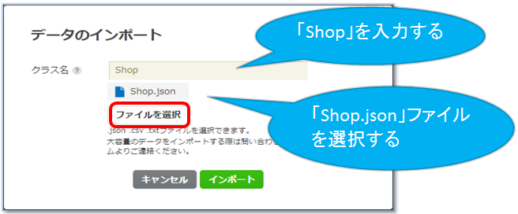
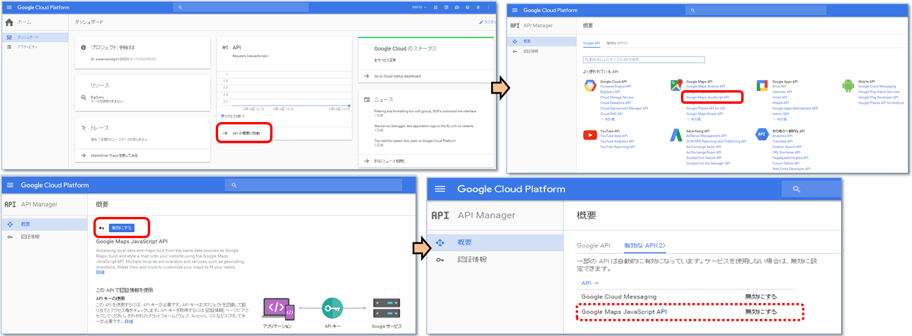
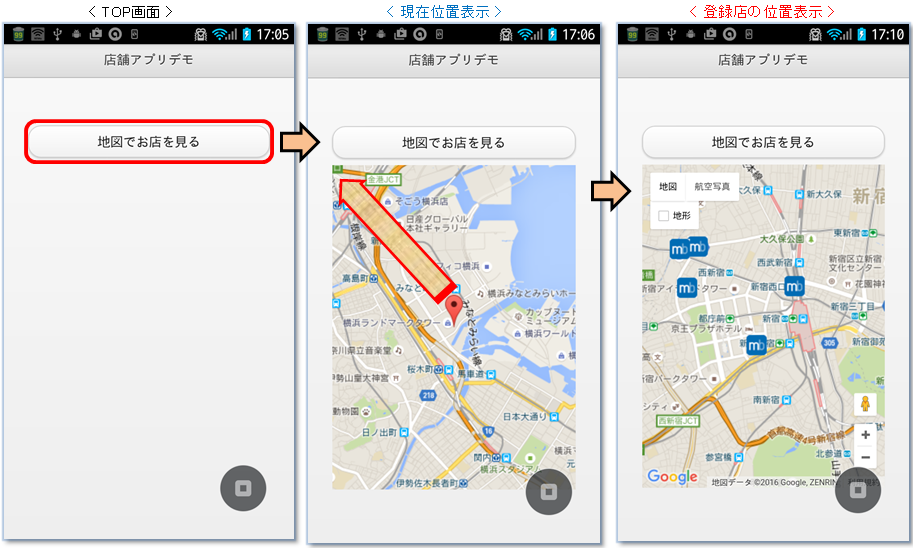
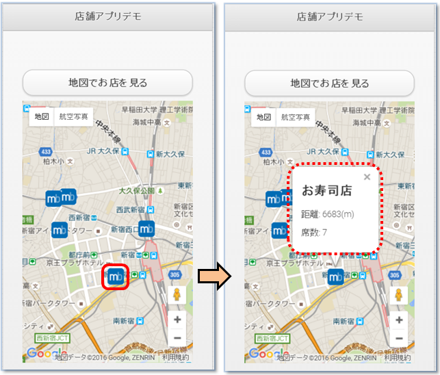
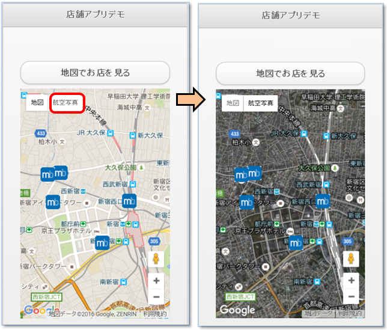

# Monaca x NIFTY Cloud mobile backend 位置情報検索サンプル

===

# Overview

Monacaを用いて作ったアプリから、mobile backendと連携して、位置情報データを検索しGoogle Map地図上に表示するサンプルコードとなります。
* HTML/CSS/JavaScriptでマルチプラットフォーム（iOS/Android/Windowsなど）にアプリを開発できる統合開発環境[Monaca](https://ja.monaca.io/)
* スマホアプリのサーバ側機能（プッシュ通知、会員管理、DBなど）をサーバ開発不要で実装できる[NIFTY Cloud mobile backend](http://mb.cloud.nifty.com/?utm_source=community&utm_medium=referral&utm_campaign=sample_monaca_map_template)



## Demo

* mBaaSサーバー側：事前に、位置情報データを用意します(Shopクラスへインポート)。
* MonacaでgithubのURL(https://github.com/ncmbadmin/monaca_map_template/archive/master.zip )をインポートし、アプリケーションキーとクライントキーを設定してください。
* アプリを起動（プレビュー）し、「地図でお店を見る」ボタンを押すと、取得した現在地データをもとに5km範囲のデータを取得し、地図上に表示します。

* トップ画面



* 位置情報検索を行い、データを表示


## Requirement

* Monaca環境
* ニフティクラウドmobile backendを利用するために必要なJavaScript SDKは、下記の方法で導入済みです。
  - 「設定」＞「JS/CSSコンポーネント追加と削除」をクリック
  - 「ncmb」を入力して｢検索｣ボタンを押す
  - 「追加｣ボタンを押す
  -  最新バージョンを選択し ｢インストール開始｣ボタンを押す
  -  ローダーの設定は｢components/ncmb/ncmb.min.js｣にチェックし｢OK｣ボタンを押す 
  -  "JS/CSSコンポーネントをプロジェクトに追加しました。" 確認の｢OK｣ボタンを押す

## Installation

* Monacaでプロジェクトをインポートし、新規アプリ作成する。
  - Monacaの利用登録
    [Monaca](https://ja.monaca.io/)


  - Monacaでプロジェクトのインポートを選択し、新規プロジェクトを作成します。


  - 「URLからインポートする」を選択し、URLに https://github.com/ncmbadmin/monaca_map_template/archive/master.zip を指定します。


* mobile backendでアプリ作成する
  - mobile backend 利用登録
    [NIFTY Cloud mobile backend](http://mb.cloud.nifty.com/?utm_source=community&utm_medium=referral&utm_campaign=sample_monaca_map_template)

  - mobile backendでアプリ作成する


* mobile backend側でデータをインポートする
 - 以下のURLからShop.jsonファイルをダウンロードする。
https://gist.github.com/ncmbadmin/c2bef258d2a63c40b0b1/archive/e9a844ed6b43d64cfc166b1788975890ff50280a.zip

mBaaSデータストアにて、作成 ＞ インポートを選択し、ダウンロードしたjsonファイルを指定してインポートする。




インポートが成功した状態


* Monacaで作成したアプリをmobile backendサーバーと連携させる
  - Monacaでアプリキー、クライアントキーを設定し、初期化を行う

キーをコピーし、追記します。


* Google map API キーの設定
 - ファイル：index.html
 - 方法は以下のように設定
 Google console: https://console.cloud.google.com/home/

※Google Maps JavaScript APIを有効にします。


※認証APIキーを作成します。


* 動作確認
  - Monacaで動作確認する

※現在位置から登録店の位置情報データを検索し、Google Map地図上に表示します。



※店の情報内容を参照出来ます。



※航空写真表示出来ます。



※ストリートビュー表示出来ます。


## Description

* コードの説明

1) File: `www/index.html`

 - 初期化設定
 
```html
<script src="https://maps.googleapis.com/maps/api/js?key=******************&sensor=false" type="text/javascript"></script>
```
上記のコードでGoogle Maps JavaScript APIキーを指定し、Google Map地図と連携を行います。

2) File: `www/js/app.js`

 - 初期化設定

```JavaScript
var appKey    = "YOUR_APPKEY";
var clientKey = "YOUR_CLIENTKEY";
var storeClassName = "Shop";
var ncmb = new NCMB(appKey,clientKey);

```

上記のコードでアプリケーションキーとクライアントキーを指定し、
NCMB(appKey, clientKey)　でmBaaSサーバと連携を行います。

* 現在地取得

「地図でお店を見る」ボタンの処理メソッドは、以下のように実装しています。

```JavaScript
  //現在地を取得する
  navigator.geolocation.getCurrentPosition(onSuccess, onError, null);
```

* 現在地取得が成功した場合のコールバック、onSuccessは以下のように設定しています。

```JavaScript
var onSuccess = function(position){
    var location = { lat: position.coords.latitude, lng: position.coords.longitude};
    //mobile backendに登録しているストアを取得し、地図で表示
    //位置情報を検索するクラスのNCMB.Objectを作成する
    var StoreClass = ncmb.DataStore(storeClassName);
    //位置情報をもとに検索する条件を設定
    var geoPoint = ncmb.GeoPoint(location.lat, location.lng);
    var mapOptions = {
                    center: location,
                    zoom: 14
                };
    var map = new google.maps.Map(document.getElementById('map_canvas'),mapOptions);
    //現在地を地図に追加
    markToMap("現在地", location, map, null);
    //mobile backend上のデータ検索を実行する
    StoreClass.withinKilometers("geolocation", geoPoint, 5)
              .fetchAll()
              .then(function(stores) {
                  // 検索が成功した場合の処理
                  for (var i = 0; i < stores.length; i++){
                      var store = stores[i];
                      var storeLocation = store.get("geolocation");
                      var myLatlng = new google.maps.LatLng(storeLocation.latitude, storeLocation.longitude);
                      //CREATE DETAIL
                      var detail = "";
                      var storeName = store.get("name");
                      detail += "<h2>"+ storeName +"</h2>";
                      var storeCapacity = store.get("capacity");
                      var storeLocation = store.get("geolocation");
                      var storeLatLng = new google.maps.LatLng(storeLocation.latitude,storeLocation.longitude);
                      var locationLatLng = new google.maps.LatLng(location.lat,location.lng);
                      var distance = Math.round(google.maps.geometry.spherical.computeDistanceBetween (locationLatLng, storeLatLng));
                      detail += "<p>距離: "+ distance + "(m)</p>";
                      detail += "<p>席数: " + storeCapacity + "</p>" ;
                      markToMap(detail, myLatlng, map, 'images/marker_mbaas.png');
                  }
               })
              .catch(function(error) {
                 // 検索に失敗した場合の処理
                 alert(error.message);
              });
};
```

"Shop"というクラスのデーターを検索するため、StoreClassのfetchAllメソッドを利用します。
検索条件は StoreClass.withinKilometers("geolocation", geoPoint, 5); と設定し、geolocationというクラスの中にある、現在地（geoPoint）から5kmの範囲(※現在の位置から任意で設定要)のキーの値を検索します。
fetchAll()メソッドを利用し、非同期にて検索を行います。

fetchAll()した後のプロミスを定義します。成功した場合にはstoresにデータが入っているはずなので、markToMap()メソッドを利用して、地図にマーカーを付けます。


## Usage

サンプルコードをカスタマイズすることで、様々な機能を実装できます！
データ保存・データ検索・会員管理・プッシュ通知などの機能を実装したい場合には、
以下のドキュメントもご参考ください。

* [ドキュメント](http://mb.cloud.nifty.com/doc/current/?utm_source=community&utm_medium=referral&utm_campaign=sample_monaca_map_template)
* [ドキュメント・データストア](http://mb.cloud.nifty.com/doc/current/sdkguide/javascript/datastore.html?utm_source=community&utm_medium=referral&utm_campaign=sample_monaca_map_template)
* [ドキュメント・会員管理](http://mb.cloud.nifty.com/doc/current/sdkguide/javascript/user.html?utm_source=community&utm_medium=referral&utm_campaign=sample_monaca_map_template)
* [ドキュメント・プッシュ通知](http://mb.cloud.nifty.com/doc/current/sdkguide/javascript/push.html?utm_source=community&utm_medium=referral&utm_campaign=sample_monaca_map_template)

## Contributing

1. Fork it!
2. Create your feature branch: `git checkout -b my-new-feature`
3. Commit your changes: `git commit -am 'Add some feature'`
4. Push to the branch: `git push origin my-new-feature`
5. Submit a pull request :D

## License

* MITライセンス
* NIFTY Cloud mobile backendのJavascript SDKのライセンス
